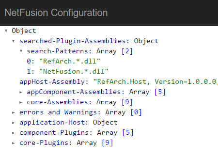
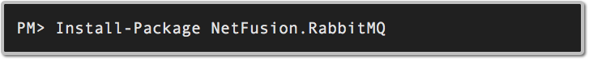
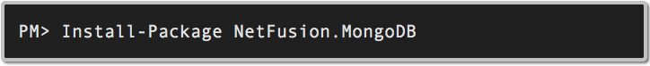
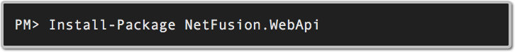
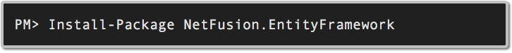

# NetFusion
NetFusion is a design for composing an application from components that remains manageable as an application grows with newly added features and technologies.

## Goals
* Allow an application to be easily composed from loosely coupled reusable components.

* Provide a well-defined application bootstrap process.

* Provide a pluggable architecture that can be easily configured.

* Allow unit-tests to be consistent and easily written for plug-ins. 

* Provide a design that is non-obstructive and does not dictate how an application’s specific business logic is implemented or structured.  This allows each plugin to be designed and structured independently.

* Provided detailed log of the application's composition.

* Allow components to be easily configured within other programming environments such as LinqPad.

## Core
The core infrastructure consists of the following components:

**[NetFusion.Bootstrap](./src/NetFusion/NetFusion.Bootstrap/README.md)**

Core assembly containing the implementation of the bootstrap process.  The end result of the bootstrap process is an initialized dependency-injection container.  

This component has a low dependency on open-source technologies.  While the bootstrap process isn't implemented using any open-source libraries, the registration process is dependent on the Autofac dependent-injection container.  While this could be abstracted, it would have made the design more complicated.      

**[NetFusion.Settings](./src/NetFusion/NetFusion.Settings/README.md)**

This assembly contains the implementation of application-settings and their initialization.  The core implementation doesn't depend on any open-source libraries but contains extension points that can be used to initialize settings using any open-source library (for example, settings can be stored in MongoDB).

**[NetFusion.Messaging](./src/NetFusion/NetFusion.Messaging/README.md)**

Provides an implementation for publishing and subscribing to messages.  The default implementation supports the publishing and subscribing of in-process messages.  As the other core assemblies, the implementation is not dependent on any open-source libraries but contains extension points that can be used to publish and subscribe to messages (for example, publishing and subscribing to messages using RabbitMQ). 

##Integration

**[Netfusion.Settings.MongoDb](./src/NetFusion/NetFusion.Settings.MongoDB/README.md)**

Extends the NetFusion.Settings Plug-in allowing application settings to be stored centrally within MongoDB.

**[Netfusion.RabbitMQ](./src/NetFusion/NetFusion.RabbitMQ/README.md)**

Extends the NetFusion.Messaging Plug-in allowing for the configuration of Exchanges, Queues, and consumers used to publish and subscribe messages to RabbitMQ.

## Infrastructure
Built on top of the bootstrap process are plug-ins for the following open-source technologies:

**[MongoDB](./src/NetFusion/NetFusion.MongoDB/README.md)**

Plug-in providing integration and configuration of MongoDB.  

Contains a database settings type that application components can derive from to represent a MongoDB instance.  This database settings type is based on NetFusion.Settings and allows it to be configured via any of the available setting initializers (i.e. MongoDb stored settings).  

This plug-in also automatically registers all MongoDB data entity mappings and provides a client interface that can be injected into dependent components.

**[WebApi](./src/NetFusion/NetFusion.WebApi/README.md)**

Plug-in used to configure the WebApi HTTP pipeline. 

**[EntityFramework](./src/NetFusion/NetFusion.EntityFramework/README.md)**

Plug-in providing integration and configuration of Entity Framework.  

Contains a database settings type that application components can derive from to represent a relational database instance.  This database settings type is based on NetFusion.Settings and allows it to be configured via any of the available setting initializers (i.e. MongoDb stored settings).  

This plug-in also automatically registers all Entity Framework data entity mappings and provides a client interface that can be injected into dependent components.

