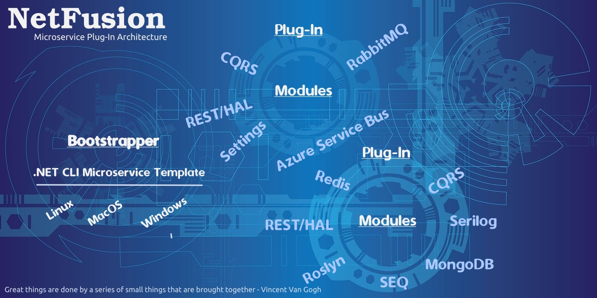

[**Quick Start**](https://github.com/grecosoft/NetFusion/wiki/quick.start)

## Problem

As more developers move towards implementing Microservice based solutions, it is important for these services to be quickly created and consistently configured.  Also, it is important that the overall structure be consistent between all Microservices that are part of a solution.  If not, each Microservice will vary overtime and become difficult to maintain and extend.

## Solution

**NetFusion** is a library enabling consistently between Microservices by providing the following:

* A well defined plug-in bootstrap process.
* Provides an implementation of the CQRS pattern that can be extended.
* Designed around Microservice architecture best practices.
* Suggests a solution structure based on Microservice best practices.
* Introduces new technologies and open-source libraries by extending with plugins.
* Very loosely coupled. Only those plugins that a given Microservice utilizes are referenced.
* Provides a consistent methodology for unit-testing.
* Allows a complete Microservice to be build in seconds by providing a custom .NET Core CLI project template.

## Outcome

* Allows developers to focus on the domain of an application since technology concerns are encapsulated within reusable plugins shared between applications and developers.
* While the use of the CQRS implementation is not required, it provides a common message pipeline that can be extended by technology specific plugins such as RabbitMQ and Azure Service Bus.

## Getting Started

The Wiki documentation is ordered so each topic builds on the prior.  Each section discusses a specific topic with step-by-step code examples.  The topics use the solution generated by the NetFusion Microservice template as a starting point for implementing examples.   
