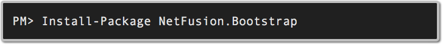
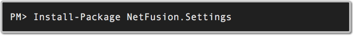
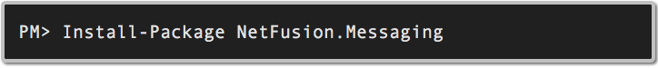

# Core Components

* ___[LinkPad Samples](../../samples/LinqPad/Core)___

## Bootstrap

* ___[Documentation](https://github.com/grecosoft/NetFusion/wiki/Bootstrap-Summary)___
* ___[Code Documentation](https://grecosoft.github.io/docs/netfusion/api/NetFusion.Bootstrap.Container.html)___
* ___[Tutorial](https://github.com/grecosoft/NetFusion/wiki/Bootstrap-Tutorial)___
   
## Logging

* ___[Documentation](https://github.com/grecosoft/NetFusion/wiki/Bootstrap-Summary)___
* ___[Code Documentation](https://grecosoft.github.io/docs/netfusion/source/api/NetFusion.Bootstrap.Container.html)___
* ___[Tutorial](https://github.com/grecosoft/NetFusion/wiki/Logging-Tutorial)___

## Settings

* ___[Documentation](https://github.com/grecosoft/NetFusion/wiki/Settings-Summary)___
* ___[Code Documentation](https://grecosoft.github.io/docs/netfusion/source/api/NetFusion.Bootstrap.Container.html)___
* ___[Tutorial](https://github.com/grecosoft/NetFusion/wiki/Settings-Tutorial)___

## Messaging

* ___[Documentation](https://github.com/grecosoft/NetFusion/wiki/Messaging-Summary)___
* ___[Code Documentation](https://grecosoft.github.io/docs/netfusion/source/api/NetFusion.Bootstrap.Container.html)___
* ___[Tutorial](https://github.com/grecosoft/NetFusion/wiki/Messaging-Tutorial)___

